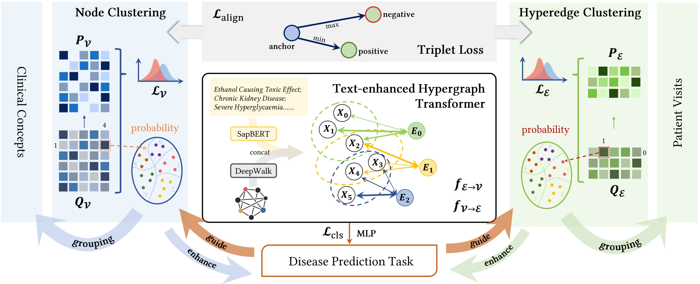

# TACCO
[KDD' 24] This repo is an official implementation of **TACCO: Task-guided Co-clustering of Clinical Concepts and Patient Visits for Disease Subtyping based on EHR Data** in PyTorch. 

## Model Pipeline


## Prerequisites
```
- PyTorch 2.1.2
- scikit-learn 1.3.2
- torch-cluster 1.6.3
- torch_geometric 2.4.0
- torch-scatter 2.1.2
- torch-sparse 0.6.18
- pandas 2.1.4
- transformers 4.36.2
```

## Data preparation

We offer two randomly generated datasets in `/data` for training demonstration. Thus, their experimental results should **NOT** reflect the performance we report in the paper. For the authentic data we used, please request access to [MIMIC-III](https://mimic.mit.edu/).

## Train TACCO

The script `demo.sh` is a **ready-to-run** shell script for a complete TACCO training process. We also provide the parameters we used in our paper, please check out `KDD24.sh`. The training results will be automatically saved in `/logs`.

## Acknowledgments

This work partly uses the code from [CACHE](https://github.com/ritaranx/CACHE).

## Cite

If you find our work useful, please cite our paper.
```
@article{zhang2024tacco,
  title={TACCO: Task-guided Co-clustering of Clinical Concepts and Patient Visits for Disease Subtyping based on EHR Data},
  author={Zhang, Ziyang and Cui, Hejie and Xu, Ran and Xie, Yuzhang and Ho, Joyce C and Yang, Carl},
  journal={arXiv preprint arXiv:2406.10061},
  year={2024}
}
```
